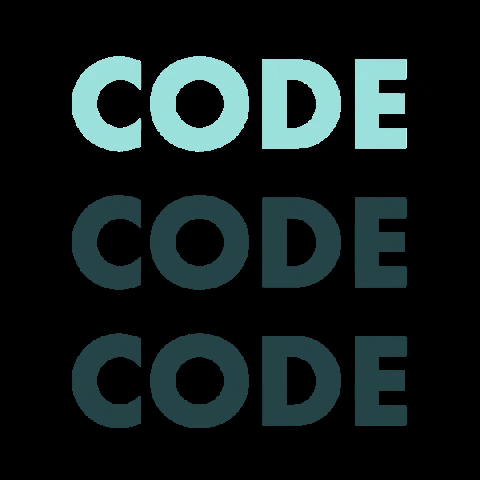

## 💻 Projeto: Site de Empresa Fictícia

  

Este projeto é um site de uma empresa fictícia, desenvolvido com o objetivo de praticar e consolidar meus conhecimentos em **HTML**, **CSS** e **JavaScript**.

### 🔧 Tecnologias utilizadas
- HTML5
- CSS3
- JavaScript (puro)

### 🎯 Objetivos
- Treinar a criação de páginas web responsivas.
- Praticar interatividade com JavaScript.
- Organizar a estrutura de um site corporativo.

### 🚀 Funcionalidades implementadas
- Layout responsivo com CSS Flexbox/Grid.
- Menu de navegação funcional.
- Interações básicas com JavaScript.

---

